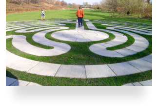
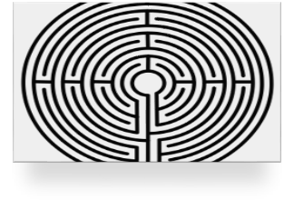
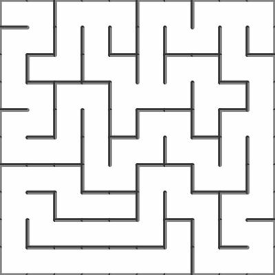
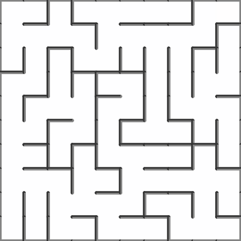
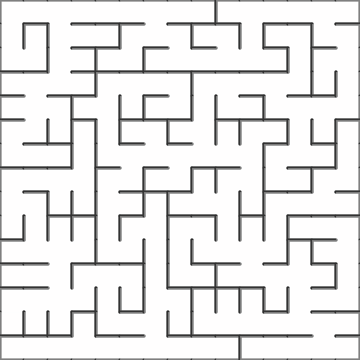
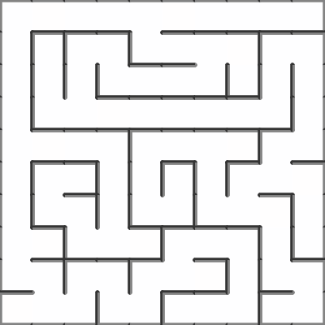
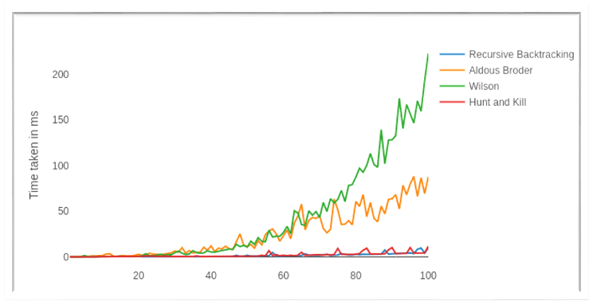
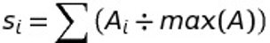
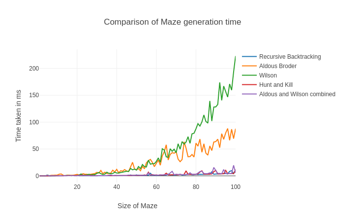

# Algo-Project
**Link to animations [here](https://shaikh-ubaid.github.io/Algo-Project/)**

**Link to other version [here](https://github.com/Shaikh-Ubaid/Maze-Generator-VanillaJS)**

**Link to research paper selected [here](http://ipsitransactions.org/journals/papers/tir/2019jan/p5.pdf)**

### Proposal [here](https://github.com/Shaikh-Ubaid/Algo-Project/blob/master/180001050_Project_Proposal.pdf)

### Presentation [here](https://github.com/Shaikh-Ubaid/Algo-Project/blob/master/Maze%20Generating%20Algorithms.pdf)

### Report [here](https://github.com/Shaikh-Ubaid/Algo-Project/blob/master/Maze%20Generation%20Algorithms%20Report.pdf)

<html>
    <body class="c149">
        <h1 class="c40 c138 title" id="h.nj23sjpj5u97">Implementation and Analysis of Maze Generating Algorithms</h1>
        

        <h3 class="c89 c40 subtitle" id="h.qy0ehwns5zow">Submitted by Shaikh Ubaid (180001050)</h3>
        <h3 class="c89 c40">Computer Science and Engineering</h3>
        <h3 class="c89 c40">2nd Year</h3>
        <h3 class="c90 c40">&nbsp;03-06-2020</h3>
        <h3 class="c90 c40 c4"></h3>
        <h3 class="c40 c89">Under the Guidance of</h3>
        <h3 class="c89 c40">Dr. Kapil Ahuja</h3>
        

        <h3 class="c90 c40 c4"></h3>
        <h3 class="c90 c40">Department of Computer Science and Engineering</h3>
        <h3 class="c90 c40">Indian Institute of Technology Indore</h3>
        <h3 class="c40 c90">Spring 2020</h3>
        <h1 class="c18" id="h.fyg1ep860f2c">ACKNOWLEDGEMENT</h1>
        

        
I am highly indebted to Dr. Kapil Ahuja, Associate Professor, IIT Indore for his guidance and constant supervision as well as for providing an opportunity to work on Algorithm Analysis in real life.

        
I am thankful to the TAs, Mr. Rohit Aggrawal and Mr. Siddharth Gupta, who guided me and supported me from the initial to the final level.

        
&nbsp;I have gained a lot of knowledge through this project, and I have had an enriching experience in this research project.&nbsp;

        

        <h1 class="c18 c98" id="h.wj14q9h13cwi"></h1>
        <h1 class="c18" id="h.47fdhnjr701o">OVERVIEW &amp; PURPOSE</h1>
        

        

        <ul class="c118 lst-kix_exhzh0b3bbrg-0 start">
            <li class="c12 c49 li-bullet-0">Goal- The main goal of this project is to rank different maze generating algorithms according to the difficulty of the generated mazes.&#8203;</li>
            <li class="c12 c49 li-bullet-0">Following our main goal, we implement and analyse four maze generating algorithms. &#8203;</li>
            <li class="c12 c49 li-bullet-0">For the purpose of evaluating and ranking maze generating algorithms, we devise four agents which solve mazes and report the results. &#8203;</li>
            <li class="c12 c49 li-bullet-0">To assess the level of difficulty of a maze we inspect several features such as the number of visited intersections, dead ends, and overall steps of the agents. </li>
            <li class="c12 c49 li-bullet-0">According to agents performances, we rank maze generating algorithms. </li>
            <li class="c12 c49 li-bullet-0">
                The best performing algorithms are derived from algorithms for finding uniform spanning trees in graphs.
                

            </li>
        </ul>
        <h1 class="c18" id="h.hg94dsx5ju2m">CONTENT</h1>
        

        

        <ol class="c118 lst-kix_yjsac9wfgreq-0 start" start="1">
            <li class="c38 li-bullet-0">
                <h2 id="h.ausbyoedw97e" style="display:inline">Introduction&#8203;</h2>
            </li>
            <li class="c38 li-bullet-0">
                <h2 id="h.ausbyoedw97e-1" style="display:inline">Generating Mazes&#8203;</h2>
            </li>
            <li class="c38 li-bullet-0">
                <h2 id="h.ausbyoedw97e-2" style="display:inline">Solving Agents&#8203;</h2>
            </li>
            <li class="c38 li-bullet-0">
                <h2 id="h.ausbyoedw97e-3" style="display:inline">Analysis&#8203;</h2>
            </li>
            <li class="c38 li-bullet-0">
                <h2 id="h.l61hleojx2y9" style="display:inline">Discussion&#8203;</h2>
            </li>
            <li class="c38 li-bullet-0">
                <h2 id="h.l61hleojx2y9-4" style="display:inline">Results&#8203;</h2>
            </li>
            <li class="c38 li-bullet-0">
                <h2 id="h.l61hleojx2y9-5" style="display:inline">Proposed Modification&#8203;</h2>
            </li>
            <li class="c38 li-bullet-0">
                <h2 id="h.l61hleojx2y9-6" style="display:inline">Conclusion&#8203; and Future</h2>
            </li>
            <li class="c38 li-bullet-0">
                <h2 id="h.l61hleojx2y9-7" style="display:inline">References&#8203;</h2>
            </li>
            <li class="c38 li-bullet-0">
                <h2 id="h.w6dmlseeekal" style="display:inline">Appendix</h2>
            </li>
        </ol>
        

        <h1 class="c18 c98" id="h.ru2b6xnbv2oz"></h1>
        <h1 class="c18" id="h.9xwpen9yb1k">1. INTRODUCTION</h1>
        

        <h2 class="c55 c40" id="h.230pduxyxzag">1.1 History</h2>
        
Mazes are closely related to labyrinths which have been known since ancient times. Usually, they were built with naturally occurring materials. Originally they have had a spiritual connotation. Their later purpose was mainly amusement. In modern times, mazes became intriguing for scientists, especially for mathematicians.&nbsp;

        
&nbsp;

        <h2 class="c55 c40" id="h.6qxcl5aukey8">1.2 Uses</h2>
        
Mazes are used in various fields besides entertainment purposes, mazes are also used in psychology studies&nbsp;of human and animal behaviour to determine space awareness and also intelligence. Among others, mazes can be used in physics, for example in the study of crystal structures.&nbsp;

        

        

        

        <h2 class="c63 c176" id="h.d0gj5yj3devc"></h2>
        <h2 class="c55 c40" id="h.gb2scjtexdgk">1.3 Project Flow</h2>
        

        
We describe and analyse four maze generating algorithms. Our algorithms are originally used in graph theory. By using a specialisation&nbsp;method we implemented them to generate mazes.

        
Perfect maze - A so-called &#39;perfect&#39; maze has every path connected to every other path, so there are no unreachable areas. Also, there are no path loops or isolated walls. There is always one unique path between any two points in the maze. 

        
We generate mazes which are represented as trees only. Our focus is on 2D and planar mazes that do not contain overpasses

        
We devise four types of agents that walk across the mazes to help us analyse the difficulty of each maze type. They tell us the number of steps they take from the beginning to the end as well as the number of visited intersections and dead ends. 

        
Finally, we analyse the relation between the properties of mazes and attributes that agents provide us with. The final goal is to determine which algorithms are giving us the most difficult mazes.&nbsp;

        
In the next section, we describe four&nbsp;maze generating algorithms. In section 3 we establish the maze solving agents and their properties. In section 4 we analyse mazes. In section 5 we have a discussion. In section 6, we present the results.

        

        
Note: The codes for all the algorithms, agents, data structure discussed in this report are given in the Appendix at the end of the report.
        

        

        <h1 class="c18" id="h.9xi95hv1qbe0">2. GENERATING MAZES</h1>
        

        
Let us first explain the data structure that we are using to represent maze. We start with the square&nbsp;grid graph. Initially, all the edges (connections) represent walls. The algorithms convert specific walls into passages. After the algorithms do their job, the subgraph made out of passages represents a tree-like structured maze. In general, mazes can contain loops, overpasses, etc., but we focused on simple ones. 

        
&nbsp; &nbsp; &nbsp; 

        
Every maze has properties which we use in the analysis, such as size, number of intersections, number of branches, average branch length and length of the dead ends (branches that do not split further). 

        

        

        
Note- All mazes analysed are square.

        <h1 class="c18 c98" id="h.4nh9x5rv9rz7"></h1>
        

        <h1 class="c18 c98" id="h.mznplfwmxzvh"></h1>
        <h3 class="c138 c40" id="h.2jnddq140jez">2.1 Recursive Backtracking (RB)</h3>
        
&nbsp;

        
Firstly, we implement the depth-first search (DFS) algorithm also called backtracking. The main idea of DFS is to go forward as much as possible, then backtrack to the first branch that has unvisited paths and repeats until everything is searched. We use randomised DFS to obtain random (non-trivial) mazes. Basic implementation of DFS uses recursion. However, we implemented it using an explicit stack to avoid stack overflow error caused by large mazes having long paths.

        
Pseudo Code/Steps:-

        

        <ol class="c118 lst-kix_lbdc15ts2ijp-0 start" start="1">
            <li class="c12 c49 li-bullet-0">Choose a starting point in the field. (used the 1st grid in implementation)&#8203;</li>
            <li class="c12 c49 li-bullet-0">Randomly choose a wall at that point and carve a passage through to the adjacent cell, but only if the adjacent cell has not been visited yet. This becomes the new current cell.&#8203;</li>
            <li class="c12 c49 li-bullet-0">If all adjacent cells have been visited, back up to the last cell that has uncarved walls and repeats.&#8203;</li>
            <li class="c12 c49 li-bullet-0">The algorithm ends when the process has backed all the way up to the starting point.&#8203;</li>
        </ol>
        
As this algorithm visits every cell of the gird, its complexity turns out to be O(n2) where n is the size of the grid.&#8203;

        

        

        
Figure 1: Maze generated by Recursive Backtracking Algorithm
        

        

        <h3 class="c141 c197" id="h.m176k828e5xq">2.2 Aldous-Broder Algorithm (AB)</h3>
        <h3 class="c138 c40" id="h.8acnxe639oga">&nbsp;</h3>
        
Aldous-Broder uses a random walk until all vertices are visited. During the walk, suitable connections between the vertices are created (under certain criteria). This algorithm is originally used to find uniform spanning tree in the graph. 

        
Pseudo Code/Steps:-

        

        <ol class="c118 lst-kix_fhyslkkskglc-0 start" start="1">
            <li class="c38 li-bullet-0">Choose a vertex. Any vertex.&#8203;</li>
            <li class="c38 li-bullet-0">Choose a connected neighbour of the vertex and travel to it. If the neighbour has not yet been visited, add the travelled edge to the spanning tree.&#8203;</li>
            <li class="c38 li-bullet-0">Repeat step 2 until all vertices have been visited.&#8203;</li>
        </ol>
        
As this algorithm and the next one are random walking, their worst-case complexities could be infinite. Hence we study their time comparison graphs.

        <h1 class="c40 c159" id="h.xm5ikzcf0pwi"></h1>
        
Figure 2: Maze generated by Aldous Broder Algorithm

        <h3 class="c138 c40" id="h.tjvv4w6e5460">2.3 Wilson&rsquo;s Algorithm (W) </h3>
        

        
Wilson&rsquo;s algorithm is originally used to find a uniform spanning tree in the graph. The algorithm is very similar to Aldous-Broder with slightly better asymptotic time-complexity in theory. In practice, Wilson turns out to be slower because it uses dictionaries unlike the Aldous-Broder, which uses only arrays. 

        

        
Pseudo Code/Steps:-

        

        <ol class="c118 lst-kix_hymzl8xfxc9-0 start" start="1">
            <li class="c38 li-bullet-0">Choose any vertex at random and add it to the UST.(Uniform Spanning Tree)&#8203;</li>
            <li class="c38 li-bullet-0">Select any vertex that is not already in the UST and perform a random walk until you encounter a vertex that is in the UST.&#8203;</li>
            <li class="c38 li-bullet-0">Add the vertices and edges touched in the random walk to the UST.&#8203;</li>
            <li class="c38 li-bullet-0">Repeat 2 and 3 until all vertices have been added to the UST.&#8203;</li>
        </ol>
        

        

        

        
Figure 3: Maze generated by Wilson Algorithm

        <h3 class="c138 c40" id="h.vfa93ak1z2mw">2.4 Hunt and Kill (HK) </h3>
        

        
The Hunt and Kill algorithm uses the idea of the recursive backtrack but it starts from a random unvisited vertex whenever it hits the dead end. It does not backtrack to the last vertex with unvisited neighbours. There is an iterative version of this, which starts from the first unvisited vertex which has a visited neighbour. 

        
Pseudo Code/Steps:-

        

        <ol class="c118 lst-kix_4i77ten1ov0t-0 start" start="1">
            <li class="c38 li-bullet-0">Choose a starting location.&#8203;</li>
            <li class="c38 li-bullet-0">Perform a random walk, carving passages to unvisited neighbours, until the current cell has no unvisited neighbours.&#8203;</li>
            <li class="c38 li-bullet-0">Enter &ldquo;hunt&rdquo; mode, where you scan the grid looking for an unvisited cell that is adjacent to a visited cell. If found, carve a passage between the two and let the formerly unvisited cell be the new starting location.&#8203;</li>
            <li class="c38 li-bullet-0">Repeat steps 2 and 3 until the hunt mode scans the entire grid and finds no unvisited cells.&#8203;</li>
        </ol>
        
Again this algorithm visits each cell once, hence time complexity is O(n2)&#8203;

        

        

        
Figure 4: Maze generated by Hunt and Kill Algorithm

        <h1 class="c18" id="h.4umnbibcx9ag">3. Solving Agents </h1>
        

        
Agents help us understand how difficult a particular maze is to solve. Agents produce various attributes of mazes with which we will later analyse the difficulty of the mazes. 

        

        
These attributes are: 

        
&bull; number of steps needed from the start to the end of maze

        
&bull; number of visited cells

        
&bull; number of visited intersections

        
&bull; number of visited dead ends

        

        

        

        <h3 class="c48 c40" id="h.4kbhq9u4v2v6">3.1 Random Walk (RW) Agent </h3>
        
The agent walks randomly from a vertex to its random neighbour until it gets to the end of the maze. In particular, when located in a node, an agent selects a neighbouring node uniformly at random and moves into it. It repeats this procedure until it finds the end. 

        

        

        <h3 class="c48 c40" id="h.hjyjjsipfhn1">3.2 Depth First Search (DFS) Agent </h3>
        
This agent walks as far as it can until it hits a dead end. The agent then backtracks to the first node with unvisited neighbours. It keeps repeating the walk until it comes to the end of the maze. The precedence of agent&rsquo;s turns at intersections are manually predefined: west, north, east, south. 

        

        

        <h3 class="c40 c48" id="h.t106lcx7hn6i">3.3 Heuristic Depth First Search (HDFS) Agent </h3>
        
Similar to the DFS agent, but selects the preferred directions with a simple heuristic. In particular neighbours with lower Manhattan distance to the end of the maze are preferred.

        
&nbsp;

        

        <h3 class="c48 c40" id="h.lzu3dtpsnmmz">3.4 Breadth-First Search (BFS) Agent </h3>
        
This agent uses the idea of BFS to solve the maze but instead of the queue to visit the nodes the agent first visits the nodes closest to the end of the maze. This agent resembles a human solver which can freely jump from one path to another (at least when solving printed mazes).
        

        

        <h1 class="c18" id="h.dz18gowmgv4j">4. Analysis </h1>
        

        
In this section, we analyse the difficulty of the mazes constructed by the above four generating algorithms. We analyse the properties of mazes and results of solving agents to determine the difficulty of mazes. For the sake of completeness we also experimentally analyse the time performance of algorithms. 

        

        <h2 class="c55 c63 c40" id="h.qquis51pw2zn"></h2>
        <h2 class="c55 c63 c40" id="h.k64mv4grakm"></h2>
        <h2 class="c55 c40" id="h.daqhvn24nb2s">4.1 Maze Generating Time </h2>
        

        
We analyse the execution time of maze generating algorithms with respect to the maze size. We did not bother to consider the number of nodes of the maze which would be a true measure. We used only the length of the side of the square grid graph because we are interested in relations among performances of different algorithms. The result is shown in Figure 5 on the next page.&#8203;

        

        

        

        
&nbsp;

        
Figure 5: Running time of the maze generating algorithms with respect to the maze size. 

        

        

        
Conclusions from the Graph:

        

        
Some algorithms stand out performance-wise. They are either exceptionally slower or faster than we would expect.&nbsp;

        
Wilson algorithm is very similar to Aldous-Broder with slightly better asymptotic time-complexity in theory. In practice, Wilson turns out to be slower because it uses dictionaries unlike the Aldous-Broder, which uses only arrays. 

        
We have&nbsp;Aldous- Broder algorithm which is surprisingly fast. It is simple and uses primitives instead of higher data structures. 

        
As both Recursive Backtracking and Hunt and Kill algorithms basically use DFS, their time complexity curves are similar.

        <h2 class="c55 c40" id="h.pp87x8puuizx">4.2 Maze Properties </h2>
        

        
To analyse the difficulty of a maze, we consider the following properties: 

        
&bull; size s 

        
&bull; number of intersections ni; intersections are vertices with more than two neighbours 

        
&bull; number of dead ends nde;&nbsp;dead ends are vertices with only one neighbour. 

        
The bigger ni, the more difficult it is to solve the maze. The same goes for dead ends. 

        

        
I generated 100 mazes (of size 20 &times; 20) of each type and calculated the number of intersections and dead ends. The average results are shown in Table 1. 

        

        
&nbsp;

        
        <table class="c193">
            <tbody>
                <tr class="c47">
                    <td class="c183" colspan="1" rowspan="1">
                        
&#8203;

                    </td>
                    <td class="c132" colspan="1" rowspan="1">
                        
No of Intersections Generated &#8203;

                    </td>
                    <td class="c191" colspan="1" rowspan="1">
                        
No of Dead Ends Generated&#8203;

                    </td>
                    <td class="c175" colspan="1" rowspan="1">
                        
Score&#8203;

                    </td>
                    <td class="c128" colspan="1" rowspan="1">
                        
Rank&#8203;

                    </td>
                </tr>
                <tr class="c21">
                    <td class="c206" colspan="1" rowspan="1">
                        
AldousBroder&#8203;

                    </td>
                    <td class="c173" colspan="1" rowspan="1">
                        
10173&#8203;

                    </td>
                    <td class="c136" colspan="1" rowspan="1">
                        
11709&#8203;

                    </td>
                    <td class="c150" colspan="1" rowspan="1">
                        
2&#8203;

                    </td>
                    <td class="c78" colspan="1" rowspan="1">
                        
1&#8203;

                    </td>
                </tr>
                <tr class="c21">
                    <td class="c117" colspan="1" rowspan="1">
                        
Wilson&#8203;

                    </td>
                    <td class="c116" colspan="1" rowspan="1">
                        
10147&#8203;

                    </td>
                    <td class="c27" colspan="1" rowspan="1">
                        
11663&#8203;

                    </td>
                    <td class="c130" colspan="1" rowspan="1">
                        
2&#8203;

                    </td>
                    <td class="c62" colspan="1" rowspan="1">
                        
1&#8203;

                    </td>
                </tr>
                <tr class="c21">
                    <td class="c171" colspan="1" rowspan="1">
                        
RecursiveBacktracking&#8203;

                    </td>
                    <td class="c192" colspan="1" rowspan="1">
                        
3973&#8203;

                    </td>
                    <td class="c179" colspan="1" rowspan="1">
                        
4216&#8203;

                    </td>
                    <td class="c86" colspan="1" rowspan="1">
                        
0.753029337&#8203;

                    </td>
                    <td class="c76" colspan="1" rowspan="1">
                        
2&#8203;

                    </td>
                </tr>
                <tr class="c21">
                    <td class="c117" colspan="1" rowspan="1">
                        
HuntAndKill&#8203;

                    </td>
                    <td class="c116" colspan="1" rowspan="1">
                        
3728&#8203;

                    </td>
                    <td class="c27" colspan="1" rowspan="1">
                        
3938&#8203;

                    </td>
                    <td class="c130" colspan="1" rowspan="1">
                        
0.7027827249&#8203;

                    </td>
                    <td class="c62" colspan="1" rowspan="1">
                        
3&#8203;

                    </td>
                </tr>
            </tbody>
        </table>
        

        
Table 1: Average number of intersections and dead ends of the mazes. 

        

        

        
Table 1 indicates that certain mazes generated with similar algorithms behave similarly. In particular, Aldous-Broder and Wilson have practically the same number of intersections and dead ends. They both originate from algorithms for finding uniform spanning tree. 

        
Hunt and Kill and Recursive backtrack have notably smaller values of ni and nde&nbsp;than other mazes. These algorithms&nbsp;originate from DFS. 

        
The larger number of intersections and dead ends means more difficult maze, one can deviate from a correct path easily. 

        
Aldous Broder and Wilson perform best in this case. 

        

        <h2 class="c63 c40 c172" id="h.g2712wt5r13k"></h2>
        <h2 class="c55 c40" id="h.5eoykyrth3kh">4.3 Agent Performance </h2>
        

        
Maze solving agents give us another set of maze properties: 

        
&bull; number of steps s that agent needed to get from the beginning to the end 

        
&bull; number of visited intersections iv, 

        
&bull; number of visited dead ends dev. 

        

        
4.3.0 Ranking

        

        
We ranked maze generating algorithms according to the performances of the maze solving agents. To rank maze generating algorithms we devised a simple method. For every algorithm i, we calculated score si: 

        

        

        

        
&nbsp;

        
where Ai represents the value of the score of an agent&nbsp;A for algorithm i, and max(A) represents the maximum value that the agent scored among all generating algorithms. According to the score si, we ranked generating algorithms. Algorithm&nbsp;with the biggest (best) score has rank 1, etc. 

        

        

        

        
4.3.1 Number of Steps 

        

        
The basic measure is the number of steps an agent makes from the start to the end. A step is defined as a transition from a node to the adjacent node. 

        
&nbsp;

        
        <table class="c91">
            <tbody>
                <tr class="c47">
                    <td class="c60" colspan="1" rowspan="1">
                        
&#8203;

                    </td>
                    <td class="c120" colspan="1" rowspan="1">
                        
DFS&#8203;

                    </td>
                    <td class="c120" colspan="1" rowspan="1">
                        
BFS&#8203;

                    </td>
                    <td class="c105" colspan="1" rowspan="1">
                        
HeuristicsDFS&#8203;

                    </td>
                    <td class="c186" colspan="1" rowspan="1">
                        
RandomWalk&#8203;

                    </td>
                    <td class="c134" colspan="1" rowspan="1">
                        
Score&#8203;

                    </td>
                    <td class="c24" colspan="1" rowspan="1">
                        
Rank&#8203;

                    </td>
                </tr>
                <tr class="c154">
                    <td class="c81" colspan="1" rowspan="1">
                        
RecursiveBacktracking&#8203;

                    </td>
                    <td class="c33" colspan="1" rowspan="1">
                        
33940&#8203;

                    </td>
                    <td class="c33" colspan="1" rowspan="1">
                        
24038&#8203;

                    </td>
                    <td class="c129" colspan="1" rowspan="1">
                        
16199&#8203;

                    </td>
                    <td class="c85" colspan="1" rowspan="1">
                        
4819386&#8203;

                    </td>
                    <td class="c42" colspan="1" rowspan="1">
                        
3.693617267&#8203;

                    </td>
                    <td class="c96" colspan="1" rowspan="1">
                        
1&#8203;

                    </td>
                </tr>
                <tr class="c21">
                    <td class="c70" colspan="1" rowspan="1">
                        
Wilson&#8203;

                    </td>
                    <td class="c56" colspan="1" rowspan="1">
                        
29585&#8203;

                    </td>
                    <td class="c56" colspan="1" rowspan="1">
                        
33568&#8203;

                    </td>
                    <td class="c77" colspan="1" rowspan="1">
                        
13346&#8203;

                    </td>
                    <td class="c174" colspan="1" rowspan="1">
                        
1715718&#8203;

                    </td>
                    <td class="c71" colspan="1" rowspan="1">
                        
3.03706382&#8203;

                    </td>
                    <td class="c39" colspan="1" rowspan="1">
                        
2&#8203;

                    </td>
                </tr>
                <tr class="c21">
                    <td class="c125" colspan="1" rowspan="1">
                        
AldousBroder&#8203;

                    </td>
                    <td class="c97" colspan="1" rowspan="1">
                        
29654&#8203;

                    </td>
                    <td class="c97" colspan="1" rowspan="1">
                        
34062&#8203;

                    </td>
                    <td class="c43" colspan="1" rowspan="1">
                        
12055&#8203;

                    </td>
                    <td class="c184" colspan="1" rowspan="1">
                        
1994888&#8203;

                    </td>
                    <td class="c121" colspan="1" rowspan="1">
                        
3.886127007&#8203;

                    </td>
                    <td class="c168" colspan="1" rowspan="1">
                        
3&#8203;

                    </td>
                </tr>
                <tr class="c21">
                    <td class="c70" colspan="1" rowspan="1">
                        
HuntAndKill&#8203;

                    </td>
                    <td class="c56" colspan="1" rowspan="1">
                        
17055&#8203;

                    </td>
                    <td class="c56" colspan="1" rowspan="1">
                        
34656&#8203;

                    </td>
                    <td class="c77" colspan="1" rowspan="1">
                        
11427&#8203;

                    </td>
                    <td class="c174" colspan="1" rowspan="1">
                        
1976270&#8203;

                    </td>
                    <td class="c71" colspan="1" rowspan="1">
                        
2.617985094&#8203;

                    </td>
                    <td class="c39" colspan="1" rowspan="1">
                        
4&#8203;

                    </td>
                </tr>
            </tbody>
        </table>
        

        

        
Table 2: Average number of steps needed from the start to the end. 

        

        

        

        
4.3.2 Visited Intersections

        
&nbsp;

        
Next, we analyse how many intersections agents visit. The more intersections that an agent visits the better chance to miss the right path. Hence, the generating algorithm is more difficult. 

        

        
&nbsp;

        
        <table class="c91">
            <tbody>
                <tr class="c47">
                    <td class="c60" colspan="1" rowspan="1">
                        
&#8203;

                    </td>
                    <td class="c120" colspan="1" rowspan="1">
                        
DFS&#8203;

                    </td>
                    <td class="c120" colspan="1" rowspan="1">
                        
BFS&#8203;

                    </td>
                    <td class="c105" colspan="1" rowspan="1">
                        
HeuristicsDFS&#8203;

                    </td>
                    <td class="c186" colspan="1" rowspan="1">
                        
RandomWalk&#8203;

                    </td>
                    <td class="c134" colspan="1" rowspan="1">
                        
Score&#8203;

                    </td>
                    <td class="c24" colspan="1" rowspan="1">
                        
Rank&#8203;

                    </td>
                </tr>
                <tr class="c154">
                    <td class="c81" colspan="1" rowspan="1">
                        
RecursiveBacktracking&#8203;

                    </td>
                    <td class="c33" colspan="1" rowspan="1">
                        
33940&#8203;

                    </td>
                    <td class="c33" colspan="1" rowspan="1">
                        
24038&#8203;

                    </td>
                    <td class="c129" colspan="1" rowspan="1">
                        
16199&#8203;

                    </td>
                    <td class="c85" colspan="1" rowspan="1">
                        
4819386&#8203;

                    </td>
                    <td class="c42" colspan="1" rowspan="1">
                        
3.693617267&#8203;

                    </td>
                    <td class="c96" colspan="1" rowspan="1">
                        
1&#8203;

                    </td>
                </tr>
                <tr class="c21">
                    <td class="c70" colspan="1" rowspan="1">
                        
Wilson&#8203;

                    </td>
                    <td class="c56" colspan="1" rowspan="1">
                        
29585&#8203;

                    </td>
                    <td class="c56" colspan="1" rowspan="1">
                        
33568&#8203;

                    </td>
                    <td class="c77" colspan="1" rowspan="1">
                        
13346&#8203;

                    </td>
                    <td class="c174" colspan="1" rowspan="1">
                        
1715718&#8203;

                    </td>
                    <td class="c71" colspan="1" rowspan="1">
                        
3.03706382&#8203;

                    </td>
                    <td class="c39" colspan="1" rowspan="1">
                        
2&#8203;

                    </td>
                </tr>
                <tr class="c21">
                    <td class="c125" colspan="1" rowspan="1">
                        
AldousBroder&#8203;

                    </td>
                    <td class="c97" colspan="1" rowspan="1">
                        
29654&#8203;

                    </td>
                    <td class="c97" colspan="1" rowspan="1">
                        
34062&#8203;

                    </td>
                    <td class="c43" colspan="1" rowspan="1">
                        
12055&#8203;

                    </td>
                    <td class="c184" colspan="1" rowspan="1">
                        
1994888&#8203;

                    </td>
                    <td class="c121" colspan="1" rowspan="1">
                        
3.886127007&#8203;

                    </td>
                    <td class="c168" colspan="1" rowspan="1">
                        
3&#8203;

                    </td>
                </tr>
                <tr class="c21">
                    <td class="c70" colspan="1" rowspan="1">
                        
HuntAndKill&#8203;

                    </td>
                    <td class="c56" colspan="1" rowspan="1">
                        
17055&#8203;

                    </td>
                    <td class="c56" colspan="1" rowspan="1">
                        
34656&#8203;

                    </td>
                    <td class="c77" colspan="1" rowspan="1">
                        
11427&#8203;

                    </td>
                    <td class="c174" colspan="1" rowspan="1">
                        
1976270&#8203;

                    </td>
                    <td class="c71" colspan="1" rowspan="1">
                        
2.617985094&#8203;

                    </td>
                    <td class="c39" colspan="1" rowspan="1">
                        
4&#8203;

                    </td>
                </tr>
            </tbody>
        </table>
        

        
Table 3: Average number of visited intersections of each agent. 

        

        
We used the same ranking technique as in section 4.3.1. Unlike the number of steps, here Hunt and Kill performs badly. The best performing algorithms are Aldous-Broder and Wilson, whose original idea is finding uniform spanning trees in graphs.

        

        

        

        
4.3.3 Visited Dead Ends 

        

        
The last property that we analyse is the number of dead ends that agents visit on average. 

        
&nbsp;

        
        <table class="c91">
            <tbody>
                <tr class="c47">
                    <td class="c144" colspan="1" rowspan="1">
                        
&#8203;

                    </td>
                    <td class="c53" colspan="1" rowspan="1">
                        
DFS&#8203;

                    </td>
                    <td class="c53" colspan="1" rowspan="1">
                        
BFS&#8203;

                    </td>
                    <td class="c170" colspan="1" rowspan="1">
                        
HeuristicsDFS&#8203;

                    </td>
                    <td class="c107" colspan="1" rowspan="1">
                        
RandomWalk&#8203;

                    </td>
                    <td class="c112" colspan="1" rowspan="1">
                        
Score&#8203;

                    </td>
                    <td class="c124" colspan="1" rowspan="1">
                        
Rank&#8203;

                    </td>
                </tr>
                <tr class="c21">
                    <td class="c169" colspan="1" rowspan="1">
                        
AldousBroder&#8203;

                    </td>
                    <td class="c72" colspan="1" rowspan="1">
                        
8187&#8203;

                    </td>
                    <td class="c72" colspan="1" rowspan="1">
                        
9718&#8203;

                    </td>
                    <td class="c61" colspan="1" rowspan="1">
                        
2718&#8203;

                    </td>
                    <td class="c79" colspan="1" rowspan="1">
                        
294181&#8203;

                    </td>
                    <td class="c115" colspan="1" rowspan="1">
                        
3.892024943&#8203;

                    </td>
                    <td class="c46" colspan="1" rowspan="1">
                        
1&#8203;

                    </td>
                </tr>
                <tr class="c21">
                    <td class="c104" colspan="1" rowspan="1">
                        
Wilson&#8203;

                    </td>
                    <td class="c35" colspan="1" rowspan="1">
                        
8059&#8203;

                    </td>
                    <td class="c35" colspan="1" rowspan="1">
                        
9557&#8203;

                    </td>
                    <td class="c156" colspan="1" rowspan="1">
                        
3047&#8203;

                    </td>
                    <td class="c137" colspan="1" rowspan="1">
                        
253293&#8203;

                    </td>
                    <td class="c99" colspan="1" rowspan="1">
                        
3.828809001&#8203;

                    </td>
                    <td class="c148" colspan="1" rowspan="1">
                        
2&#8203;

                    </td>
                </tr>
                <tr class="c21">
                    <td class="c126" colspan="1" rowspan="1">
                        
RecursiveBacktracking&#8203;

                    </td>
                    <td class="c82" colspan="1" rowspan="1">
                        
3188&#8203;

                    </td>
                    <td class="c82" colspan="1" rowspan="1">
                        
2120&#8203;

                    </td>
                    <td class="c131" colspan="1" rowspan="1">
                        
627&#8203;

                    </td>
                    <td class="c140" colspan="1" rowspan="1">
                        
219894&#8203;

                    </td>
                    <td class="c201" colspan="1" rowspan="1">
                        
3.367494267&#8203;

                    </td>
                    <td class="c199" colspan="1" rowspan="1">
                        
3&#8203;

                    </td>
                </tr>
                <tr class="c21">
                    <td class="c104" colspan="1" rowspan="1">
                        
HuntAndKill&#8203;

                    </td>
                    <td class="c35" colspan="1" rowspan="1">
                        
1213&#8203;

                    </td>
                    <td class="c35" colspan="1" rowspan="1">
                        
3343&#8203;

                    </td>
                    <td class="c156" colspan="1" rowspan="1">
                        
855&#8203;

                    </td>
                    <td class="c137" colspan="1" rowspan="1">
                        
97047&#8203;

                    </td>
                    <td class="c99" colspan="1" rowspan="1">
                        
1.102655158&#8203;

                    </td>
                    <td class="c148" colspan="1" rowspan="1">
                        
4&#8203;

                    </td>
                </tr>
            </tbody>
        </table>
        

        
Table 4: Average number of visited dead ends of each agent. 

        

        

        <h1 class="c18" id="h.j9o3gvpbhao">5. Discussion </h1>
        

        
Our goal was to rank the maze generating algorithms from those that generate the most difficult mazes to those that generate the least difficult mazes. 

        

        
We did that with the help of two criteria: 

        <ol class="c118 lst-kix_nbbwavntwgua-0 start" start="1">
            <li class="c12 c49 li-bullet-0">maze properties and </li>
            <li class="c12 c49 li-bullet-0">solving agents performances. </li>
        </ol>
        

        <h1 class="c18 c98" id="h.ohjlvwboqelq"></h1>
        <h1 class="c18" id="h.xmwj379pgjua">6. Results</h1>
        
We ranked the algorithms according to the criteria. The final ranking of difficulty level: For every measure, we ranked algorithms. Finally, we calculated the average of all the ranks which gives us the final order in Table 5.&nbsp;

        

        
&nbsp;

        
        <table class="c122">
            <tbody>
                <tr class="c108">
                    <td class="c145" colspan="1" rowspan="1">
                        
&#8203;

                    </td>
                    <td class="c127" colspan="1" rowspan="1">
                        
Steps were taken by different agents&#8203;

                    </td>
                    <td class="c200" colspan="1" rowspan="1">
                        
Intersections Visited by different agents&#8203;

                    </td>
                    <td class="c143" colspan="1" rowspan="1">
                        
Dead Ends&#8203;

                        
Visited by different agents&#8203;

                    </td>
                    <td class="c189" colspan="1" rowspan="1">
                        
TotalIntersections and Dead EndsGenerated&#8203;

                    </td>
                    <td class="c155" colspan="1" rowspan="1">
                        
Average&#8203;

                    </td>
                    <td class="c53" colspan="1" rowspan="1">
                        
Rank&#8203;

                    </td>
                </tr>
                <tr class="c21">
                    <td class="c109" colspan="1" rowspan="1">
                        
AldousBroder&#8203;

                    </td>
                    <td class="c139" colspan="1" rowspan="1">
                        
3&#8203;

                    </td>
                    <td class="c208" colspan="1" rowspan="1">
                        
1&#8203;

                    </td>
                    <td class="c161" colspan="1" rowspan="1">
                        
1&#8203;

                    </td>
                    <td class="c181" colspan="1" rowspan="1">
                        
1&#8203;

                    </td>
                    <td class="c64" colspan="1" rowspan="1">
                        
1.5&#8203;

                    </td>
                    <td class="c72" colspan="1" rowspan="1">
                        
1&#8203;

                    </td>
                </tr>
                <tr class="c21">
                    <td class="c178" colspan="1" rowspan="1">
                        
Wilson&#8203;

                    </td>
                    <td class="c177" colspan="1" rowspan="1">
                        
2&#8203;

                    </td>
                    <td class="c100" colspan="1" rowspan="1">
                        
2&#8203;

                    </td>
                    <td class="c31" colspan="1" rowspan="1">
                        
2&#8203;

                    </td>
                    <td class="c188" colspan="1" rowspan="1">
                        
1&#8203;

                    </td>
                    <td class="c187" colspan="1" rowspan="1">
                        
1.75&#8203;

                    </td>
                    <td class="c35" colspan="1" rowspan="1">
                        
2&#8203;

                    </td>
                </tr>
                <tr class="c21">
                    <td class="c157" colspan="1" rowspan="1">
                        
RecursiveBacktracking&#8203;

                    </td>
                    <td class="c57" colspan="1" rowspan="1">
                        
1&#8203;

                    </td>
                    <td class="c83" colspan="1" rowspan="1">
                        
3&#8203;

                    </td>
                    <td class="c163" colspan="1" rowspan="1">
                        
3&#8203;

                    </td>
                    <td class="c87" colspan="1" rowspan="1">
                        
2&#8203;

                    </td>
                    <td class="c205" colspan="1" rowspan="1">
                        
2.25&#8203;

                    </td>
                    <td class="c82" colspan="1" rowspan="1">
                        
3&#8203;

                    </td>
                </tr>
                <tr class="c21">
                    <td class="c178" colspan="1" rowspan="1">
                        
HuntAndKill&#8203;

                    </td>
                    <td class="c177" colspan="1" rowspan="1">
                        
4&#8203;

                    </td>
                    <td class="c100" colspan="1" rowspan="1">
                        
4&#8203;

                    </td>
                    <td class="c31" colspan="1" rowspan="1">
                        
4&#8203;

                    </td>
                    <td class="c188" colspan="1" rowspan="1">
                        
3&#8203;

                    </td>
                    <td class="c187" colspan="1" rowspan="1">
                        
3.75&#8203;

                    </td>
                    <td class="c35" colspan="1" rowspan="1">
                        
4&#8203;

                    </td>
                </tr>
            </tbody>
        </table>
        

        

        
Table 5: Ranking of algorithms by the level of the difficulty of Mazes generated. 

        

        

        
Having established the ranking of the algorithms&nbsp;we can now find the properties that distinguish among the various levels of difficulty of the algorithms.

        
&nbsp;

        
The number of intersections is correlated to the difficulty of mazes. More intersections mean that the maze is more difficult and that there is more chance to miss the correct path. The type of algorithm contributes to the level of the difficulty: 

        

        
&bull; Best results are achieved by Aldous- Broder and Wilson. They originate from algorithms for finding uniform spanning trees in graphs. We speculate that agents have difficulty navigating through the maze because the paths are unbiased in any direction. 

        

        
&bull; The worst performing pair is Recursive Backtracking, and Hunt and Kill algorithms. They originate from the graph search algorithms. On the other hand, most solving agents use the same approach which enables them to solve the maze easily. Therefore the mazes are generated in a way that suits the solving agents. 

        

        

        <h1 class="c18" id="h.2718fdqc4va7">7. Combining Aldous Broder and Wilson</h1>
        
Problem Tackled

        

        
In Wilson&rsquo;s Algorithm, it takes too much time initially to find paths to already visited vertices as it uses loop-erased random walk and its loops are frequently erased in the beginning as the number of visited vertices is less in the beginning and hence, finding a path to a visited vertex is difficult. 

        
In Aldous Broder, it takes too much time in the end to visit the unvisited vertices, as it is a random walking algorithm and does not have any sense of direction/attraction towards the unvisited vertices located in corners.

        

        

        
Solution proposed

        

        
The idea is to combine both Aldous-Broder and Wilson&rsquo;s Algorithm. Doing AB until about 30% of the field is filled, and then switching to Wilson&#39;s which empirically improves the odds quite a bit.

        

        
Why this solution is better

        

        
As we will be doing Aldous Broder initially, it won&rsquo;t take much time to fill about 30% of the maze (that is visiting at least 30% of the available vertices) as this algorithm is fast in the beginning. Then we switch to Wilson&rsquo;s Algorithm, which will also work fast as it has started from a state where the density of visited vertices is more. Aldous Broder is not good at the end and Wilson is not good at the beginning. So we use Aldous at the beginning and later Wilson so that the drawbacks of both are eliminated and the benefits of both are combined.

        

        

        
Graph After Combining both the Algorithms

        

        

        
Here, we can see clearly that the Combined Algorithm takes much less time as compared to Aldous Broder and Wilson&rsquo;s Algorithm.

        

        
Note:&nbsp;Code for Combined Algorithm is given in the Appendix.
        

        

        <h1 class="c18" id="h.rxerrl1hc9r1">8. Conclusion and Future</h1>
        

        
In our project, we studied and analysed two different approaches of generating mazes and were able to rank them by levels of difficulty. Nevertheless, both two considered types were somehow kindred since they are used for finding trees in graphs. In the future, it would be useful to take into consideration algorithms with a completely different approach and then compare the results. 

        
As a continuation of our work, it would be worthwhile looking into more complex mazes such as spatial, braided, overlapping, etc.&nbsp;

        

        

        <h1 class="c160" id="h.wmio8ehnb7q8">9. References</h1>
        

        <ol class="c118 lst-kix_ynz5qdcgvs96-0 start" start="1">
            <li class="c38 li-bullet-0">Gabrov&#711;sek, Peter, &ldquo;<a class="c25" href="https://www.google.com/url?q=http://ipsitransactions.org/journals/papers/tir/2019jan/p5.pdf&amp;sa=D&amp;source=editors&amp;ust=1621719518791000&amp;usg=AOvVaw1ZRUAfmMXv7Nfq7lhd4ioX">Analysis of Maze Generating Algorithms</a>&rdquo;, The IPSI BgD Transactions on Internet Research, January 2019 Volume 15 Number 1 (ISSN 1820-4503).</li>
            <li class="c38 li-bullet-0">Wikipedia contributors. &ldquo;<a class="c25" href="https://www.google.com/url?q=https://en.wikipedia.org/w/index.php?title%3DMaze_generation_algorithm%26oldid%3D959964520.&amp;sa=D&amp;source=editors&amp;ust=1621719518792000&amp;usg=AOvVaw2LfpbHZtUGMNTX44SkhXTN">Maze generation algorithm</a>&rdquo; [Internet]. Wikipedia, The Free Encyclopedia; 2020 May 31.</li>
            <li class="c38 li-bullet-0">A. Karlsson, &ldquo;<a class="c25" href="https://www.google.com/url?q=http://urn.kb.se/resolve?urn%3Durn:nbn:se:bth-16839&amp;sa=D&amp;source=editors&amp;ust=1621719518793000&amp;usg=AOvVaw3MAYQjkxgZeMBcZ69wR04V">Evaluation of the Complexity of Procedurally Generated Maze Algorithms</a>,&rdquo; Dissertation, 2018.</li>
            <li class="c38 li-bullet-0">Jamis Buck, <a class="c25" href="https://www.google.com/url?q=http://weblog.jamisbuck.org/2011/2/7/maze-generation-algorithm-recap&amp;sa=D&amp;source=editors&amp;ust=1621719518794000&amp;usg=AOvVaw3iztl9VkVq68kSijbXrvqX">&quot;Maze Generation: Algorithm Recap&rdquo;,</a>&nbsp;the Buckblog 7 February 2011.</li>
            <li class="c38 li-bullet-0">Ms. Shivani H. Shah, Ms. Jagruti M. Mohite, Mr. Anoop G. Musale, Mr. Jay L. Borade, &ldquo;<a class="c25" href="https://www.google.com/url?q=https://www.ijser.org/researchpaper/Survey-Paper-on-Maze-Generation-Algorithms-for-Puzzle-Solving-Games.pdf&amp;sa=D&amp;source=editors&amp;ust=1621719518794000&amp;usg=AOvVaw2e1x-lcsf-8ELgAx3MyXpS">Survey Paper on Maze Generation Algorithms for Puzzle Solving Games</a>&rdquo;, International Journal of Scientific &amp; Engineering Research, Volume 8, Issue 2, February-2017 (ISSN 2229-5518).</li>
        </ol>
        

            <h4 class="c40 c165" id="h.37o5xb65948r">&nbsp; </h4>
        

    </body>
</html>
